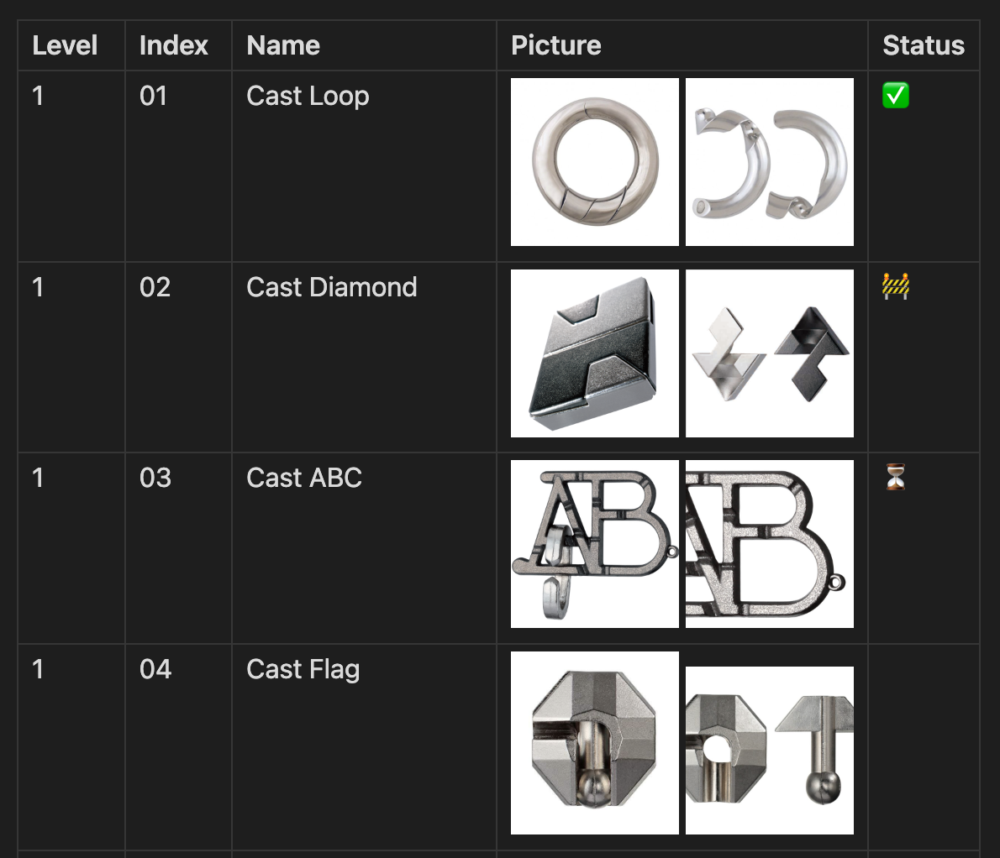

# Track-a-Lot Plugin

This is a tracker plugin for Obsidian (https://obsidian.md).

It scrapes different webpages, builds Markdown tables with the information, and allows you to
manually track them using a status column.

You can write anything in the status column, and it will be preserved when you update the list.

## Usage

- Create or select a note
- Make sure the note is in editing mode (https://help.obsidian.md/Editing+and+formatting/Edit+and+preview+Markdown)
- Open the command palette (https://help.obsidian.md/Plugins/Command+palette)
- Search for the `Track-a-Lot: Update list` command
- Press <kbd>Enter</kbd>
